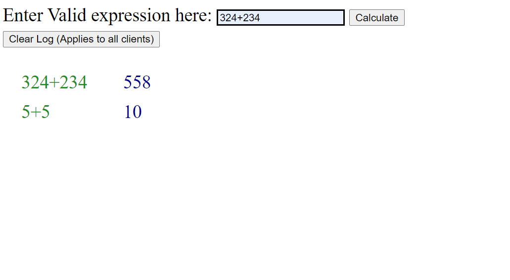

Prerequisites: NodeJS
 
 
Description: 
  This app is based around the JS library socket io, which allows bi direction communications, hence avoiding making a lot of http requests. 
  For a "live inter-client/chatroom" type scenario, this seemed like an efficient solution. The front end is vanilla JS, and the back end is nodeJs
 
 
Features:
 
  a. Has a "clear log" button, that for now clears the log acros all clients
   
  b. If entered expresion in invalid, the box turns red, notifying that the expression is not valid
   
   
Installation: 
  1. cd into the repository
  2. npm install 
  3. npm start
  4. navigate to https://localhost:8000 
 

